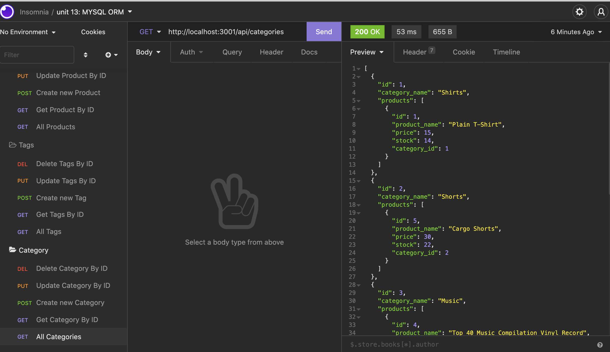

# Object Relational Mapping E-Commerce Back End

  ## Description
  This application creates a mock E-Commerce Back End that has contains tags, categories and products. It also utilizes CRUD operations, One to Many relations and Many to Many relations. This application uses node, MySQL, Sequelize and express.

  ## Table of Contents

  * [Installation](#installation)

  * [Usage](#usage)

  * [Visuals](#visuals)

  * [Deployed Links](#deployed-links)

  * [Questions](#questions)


  ## Installation

  To install necessary dependencies, run the following commands:
  ```mysql -u root```

  ```source db/schema.sql```

  ```exit```

  ```npm i```

  ```npm seed```

  ```npm start```

  ## Usage

  This DB is not hosted. To use this app make sure to import the schema and seed data from the db folder.  If you have MySQL installed, run ```mysql -u root```. While in the mySQL shell, run ```source db/schema.sql ``` and then ```exit```. After this, run ``` npm i ```,``` npm seed ``` and ``` npm start ```.

## Visuals
  

## Deployed Links

* [Demo Video](https://watch.screencastify.com/v/f7LVUXWYmQbn6hXOrmiu)

* [The URL of the GitHub repository.](https://github.com/simone188535/Object-Relational-Mapping-E-Commerce-Back-End)
  ## Questions

  If you have any questions about the repo, open
  an issue or contact me directly at simone.anthony1@yahoo.com. You
  can find more of me at [simone188535](https://github.com/simone188535)
